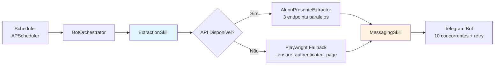

<p align="center">
  
</p>

<h1 align="center">Aluno Presente Bot</h1>

<p align="center">
  <strong>Bot de raspagem e disparo de relatórios para o sistema <a href="https://cba.alunopresente.srv.br">Aluno Presente</a> (SME/CBA)</strong>
</p>

<p align="center">
  <a href="#-arquitetura"><strong>Arquitetura</strong></a> •
  <a href="#-quick-start"><strong>Quick Start</strong></a> •
  <a href="#-api-endpoints"><strong>API</strong></a> •
  <a href="#-comandos-telegram"><strong>Telegram</strong></a> •
  <a href="#-testes"><strong>Testes</strong></a> •
  <a href="#-deploy"><strong>Deploy</strong></a>
</p>

<p align="center">
  <!-- Core Stack -->
  
  
  
  
  <br/>
  <!-- Automation & Data -->
  
  
  
  <br/>
  <!-- Infrastructure -->
  
  
  
  <br/>
  <!-- Quality -->
  
  
  
</p>

---

## 🎯 Visão Geral

O **Aluno Presente Bot** automatiza a extração de dados de **frequência** e **alimentação escolar** do sistema Aluno Presente (CBA/SME) e dispara relatórios formatados via **Telegram** para gestores e secretarias.

| Funcionalidade | Status |
|----------------|--------|
| 🔐 Autenticação OAuth2 segura (BFF + cookies HttpOnly) | ✅ |
| 🕷 Raspagem híbrida: API interna + fallback Playwright | ✅ |
| 🔄 Re-login automático (token JWT ~24h) | ✅ |
| 📅 Agendamento persistente (APScheduler + DjangoJobStore) | ✅ |
| 📊 Relatórios com métricas, % e formatação pt-BR | ✅ |
| 🤖 9 comandos Telegram interativos | ✅ |
| 🎯 Filtros por unidade, período, região | ✅ |
| 📈 Histórico de execuções + estatísticas | ✅ |
| 🖥 Painel Admin Django completo | ✅ |
| 🐳 Docker Compose (5 serviços isolados) | ✅ |

---

## 🏗 Arquitetura



### 🧩 Skills (Clean Architecture)

| Skill | Arquivo | Responsabilidade |
|-------|---------|------------------|
| `AuthenticationSkill` | `skills/auth.py` | Login no site alvo + persistência `storage_state.json` |
| `AuthSkill` (util) | `skills/auth_skill.py` | Leitura/escrita/limpeza do estado do navegador |
| `NavigationSkill` | `skills/navigation_skill.py` | Navegação Playwright genérica |
| `ExtractionSkill` | `skills/extract_skill.py` | **Orquestrador**: detecta `site_type`, API → fallback, re-login 401 |
| `MessagingSkill` | `skills/messaging_skill.py` | Jinja2 + Telegram (10 concorrentes, timeout 10s, 3 retries) |

### 🔌 Extractors (Plugin Registry)

```python
# Adicionar novo site = criar arquivo em extractors/ com @register
@register
class MeuSiteExtractor(SiteExtractor):
    site_type = 'meu_site'
    site_label = 'Meu Site'
    site_domain = 'meusite.com'
    login_url = 'https://meusite.com/login'  # se autenticado
    
    async def extract_via_api(self, ...): ...
    async def extract_via_playwright(self, ...): ...
    async def relogin(self): ...
```

| Extractor | `site_type` | Modo | Recursos |
|-----------|-------------|------|----------|
| `AlunoPresenteExtractor` | `aluno_presente` | API + Playwright | 3 endpoints paralelos, `extract_single_unit()`, filtro `unit_ids`/`period` |
| `GenericExtractor` | `generic` | Playwright apenas | Sem login, tolera campos sem selector (retorna `None`) |

---

## 🚀 Quick Start

### Pré-requisitos
- Docker 24+ & Docker Compose 2+
- Conta Telegram + Bot Token (`@BotFather`)

### 1. Clone e configure
```bash
git clone https://github.com/seu-usuario/bot-alunop.git
cd bot-alunop
cp .env.example .env
```

### 2. Edite `.env` com suas credenciais
```bash
# Django
SECRET_KEY=sua-chave-secreta-super-forte
DEBUG=False
ALLOWED_HOSTS=seu-dominio.com,www.seu-dominio.com
CSRF_TRUSTED_ORIGINS=https://seu-dominio.com

# PostgreSQL
POSTGRES_USER=postgres
POSTGRES_PASSWORD=senha-muito-forte-aqui
POSTGRES_DB=scraper_bot

# Site Aluno Presente
TARGET_SITE_USER=seu-usuario-sme
TARGET_SITE_PASSWORD=sua-senha-sme
TARGET_SITE_URL=https://cba.alunopresente.srv.br

# Telegram
TELEGRAM_BOT_TOKEN=123456789:ABCdefGhIJKlmNoPQRsTUVwxyZ
TELEGRAM_ADMIN_CHAT_ID=987654321  # Alertas de falha do scheduler
```

### 3. Suba a stack
```bash
docker compose up -d
```

### 4. Acesse
| Serviço | URL |
|---------|-----|
| 🎛 **Painel Web** | http://localhost:8080 |
| 🔧 **Admin Django** | http://localhost:8080/admin/ |
| 📚 **API Docs (Swagger)** | http://localhost:8080/api/docs |

---

## 🐳 Serviços Docker

```yaml
services:
  db:           # PostgreSQL 15 Alpine + healthcheck
  backend:      # Django + Ninja API (porta 8000)
  scheduler:    # APScheduler persistente (heartbeat 60s)
  listener:     # Telegram poller único + offset persistido
  nginx:        # Proxy reverso :8080 + static files + security headers
```

```bash
# Logs
docker compose logs -f backend
docker compose logs -f scheduler
docker compose logs -f listener

# Reiniciar serviço específico
docker compose restart scheduler
```

---

## 📚 API Endpoints

<details>
<summary><strong>🔐 Autenticação</strong></summary>

| Método | Endpoint | Descrição |
|--------|----------|-----------|
| `POST` | `/api/auth/login/` | Login (rate limited) — define cookie de sessão HttpOnly |
| `POST` | `/api/auth/logout/` | Logout — limpa sessão + admin Django |
| `GET` | `/api/auth/me/` | Usuário autenticado atual |
</details>

<details>
<summary><strong>⚙️ Configuração (BotConfig, Template, Recipient)</strong></summary>

| Método | Endpoint | Descrição |
|--------|----------|-----------|
| `GET` | `/api/configs/` | Listar configurações de bot |
| `POST` | `/api/configs/` | Criar nova configuração |
| `GET` | `/api/configs/{id}/` | Detalhar configuração |
| `PUT` | `/api/configs/{id}/` | Atualizar configuração |
| `DELETE` | `/api/configs/{id}/` | Remover configuração |
| `GET/POST` | `/api/templates/` | CRUD de templates de mensagem |
| `GET/POST` | `/api/recipients/` | CRUD de destinatários |
</details>

<details>
<summary><strong>▶️ Execução & Dados</strong></summary>

| Método | Endpoint | Descrição |
|--------|----------|-----------|
| `POST` | `/api/execute/` | Executa extração + envio (assíncrono) |
| `POST` | `/api/execute/preview/` | **Modo preview** — extração sem envio |
| `GET` | `/api/stats/` | Estatísticas agregadas (ORM optimized) |
| `GET` | `/api/school-unities/` | Lista 185 unidades escolares |
| `GET` | `/api/site-types/` | Tipos de site no registry |
| `GET` | `/api/health/` | Health check (a implementar) |
</details>

> 📖 **Documentação interativa completa**: [`/api/docs`](http://localhost:8080/api/docs) (Swagger/OpenAPI via Django Ninja)

---

## 🤖 Comandos Telegram

| Comando | Descrição | Exemplo |
|---------|-----------|---------|
| `/start` | Boas-vindas + menu interativo | `/start` |
| `/relatorio_completo` | Relatório completo da rede (todas unidades) | `/relatorio_completo` |
| `/resumo_secretaria` | Resumo executivo para secretaria | `/resumo_secretaria` |
| `/resumo_diario` | Resumo do dia atual | `/resumo_diario` |
| `/unidades` | Lista todas as 185 unidades (ID + nome) | `/unidades` |
| `/unidade <nome>` | Busca fuzzy + relatório individual | `/unidade EMEB ADELINA` |
| `/unidade_id <id>` | Consulta por ID numérico | `/unidade_id 132` |
| `/periodos` | Lista períodos (MATUTINO, VESPERTINO, INTEGRAL, NOTURNO) | `/periodos` |
| `/unidades <período>` | Filtra escolas por período | `/unidades MATUTINO` |

> 💡 **Alias**: `/unidadeid` funciona igual a `/unidade_id` (facilita no celular)

---

## 🧪 Testes

```bash
# Todos os testes (61 testes, 18 de segurança)
docker exec aluno_presente_backend python manage.py test aluno_presente_sme.tests

# Por módulo
docker exec aluno_presente_backend python manage.py test aluno_presente_sme.tests.test_scheduler
docker exec aluno_presente_backend python manage.py test aluno_presente_sme.tests.test_extractors
docker exec aluno_presente_backend python manage.py test aluno_presente_sme.tests.test_messaging
docker exec aluno_presente_backend python manage.py test aluno_presente_sme.tests.test_services
docker exec aluno_presente_backend python manage.py test aluno_presente_sme.tests.test_security

# Verificações Django
docker exec aluno_presente_backend python manage.py check
docker exec aluno_presente_backend python manage.py check --deploy
```

### Cobertura Atual
- ✅ **61 testes passando** (18 segurança, 12 extractors, 11 messaging, 10 scheduler, 10 services)
- ✅ `manage.py check` — zero issues
- ⏳ **Cobertura alvo**: 85%+ (pendente `coverage.py` no CI)

---

## 📁 Estrutura do Projeto

```text
bot-alunop/
├── 🐳 docker-compose.yml       # 5 serviços isolados + healthchecks
├── 🐳 Dockerfile               # Python 3.11 slim + Playwright Chromium
├── ⚙️ entrypoint.sh            # Migrate + collectstatic + runserver
├── 🌐 nginx.conf               # Proxy :8080 + security headers + gzip
├── 📦 requirements.txt         # 12 dependências pinadas
├── 🔐 .env.example             # Template de variáveis de ambiente
├── 📋 backlog.md               # Backlog completo (41 done, 10 bugs fixed, 6 pending)
│
├── backend/
│   ├── manage.py
│   ├── core/                   # Settings, URLs, Views (templates server-side)
│   ├── api/                    # Django Ninja (SessionAuth)
│   │   ├── api.py              # NinjaAPI instance
│   │   ├── auth.py             # /auth/login, /logout, /me
│   │   ├── endpoints.py        # CRUD + /execute + skills + stats
│   │   └── urls.py
│   │
│   ├── aluno_presente_sme/     # APP PRINCIPAL
│   │   ├── models.py           # BotConfig, MessageTemplate, Recipient, ExecutionLog, UnitPeriod
│   │   ├── schemas.py          # Contratos Pydantic v2 (strict typing)
│   │   ├── services.py         # BotOrchestrator (exec, retry, preview, log)
│   │   ├── scheduler.py        # APScheduler + DjangoJobStore + sync_jobs_from_db
│   │   ├── signals.py          # post_save/post_delete → agenda/remove jobs
│   │   ├── admin.py            # Admin Django customizado
│   │   │
│   │   ├── skills/             # 🧩 MÓDULOS ISOLADOS (Single Responsibility)
│   │   │   ├── auth.py               # AuthenticationSkill
│   │   │   ├── auth_skill.py         # storage_state.json persistence
│   │   │   ├── extract_skill.py      # ExtractionSkill (orquestração)
│   │   │   ├── messaging_skill.py    # MessagingSkill (Jinja2 + Telegram)
│   │   │   ├── navigation_skill.py   # NavigationSkill
│   │   │   └── extractors/           # 🔌 PLUGIN REGISTRY
│   │   │       ├── base.py           # SiteExtractor (ABC) + helpers
│   │   │       ├── registry.py       # @register / get_extractor / list_site_choices
│   │   │       ├── aluno_presente.py # API interna + fallback Playwright
│   │   │       └── generic.py        # Genérico (Playwright)
│   │   │
│   │   ├── management/commands/
│   │   │   ├── run_scheduler.py      # Serviço scheduler (heartbeat 60s)
│   │   │   ├── listen_telegram.py    # Serviço listener (poller único)
│   │   │   └── run_bot.py            # Execução manual: `manage.py run_bot --config-id 1`
│   │   │
│   │   └── tests/                    # Django TestCase (não pytest)
│   │       ├── test_scheduler.py
│   │       ├── test_messaging.py
│   │       ├── test_services.py
│   │       ├── test_extractors.py
│   │       └── test_security.py
│   │
│   ├── frontend/             # Templates (login, dashboard, logout) + static/
│   └── scripts/              # explore_page.py, find_analise_api.py (análise do site alvo)
│
└── playwright_state/         # 📦 Volume Docker (storage_state.json, telegram_offset.txt)
```

---

## 🔒 Segurança

| Camada | Implementação |
|--------|---------------|
| **Autenticação** | OAuth2 BFF — tokens **nunca** no `localStorage`, apenas cookies `HttpOnly` + `Secure` + `SameSite=Lax` |
| **Credenciais site alvo** | Variáveis de ambiente (`.env`) — **zero hardcode** |
| **Sessão Playwright** | `storage_state.json` em volume Docker (`playwright_session`) — reutiliza cookies, evita bloqueios |
| **Rate Limiting** | `django-ratelimit` em `/api/auth/login/` |
| **Headers HTTP** | Nginx: `X-Frame-Options: DENY`, `X-Content-Type-Options: nosniff`, `Referrer-Policy: strict-origin-when-cross-origin`, `Content-Security-Policy` |
| **TLS** | Terminação no Nginx (certificados Let's Encrypt recomendados) |
| **⚠️ Known Issue** | `verify=False` em `httpx.AsyncClient` (`aluno_presente.py:41`) — **[#176](https://github.com/seu-usuario/bot-alunop/issues/176)** substituição por CA confiável |

---

## 📦 Deploy em Produção

### ✅ Checklist Pré-Deploy

- [ ] `DEBUG=False` no `.env`
- [ ] `SECRET_KEY` forte (gere com `python -c "from django.core.management.utils import get_random_secret_key; print(get_random_secret_key())"`)
- [ ] `ALLOWED_HOSTS` e `CSRF_TRUSTED_ORIGINS` para seu domínio
- [ ] `POSTGRES_PASSWORD` forte + rotação periódica
- [ ] Volumes persistidos: `postgres_data`, `playwright_session`
- [ ] Backup automatizado (3-2-1: Borg + Rclone + Telegram alerts)
- [ ] Healthchecks ativos em **todos** os serviços
- [ ] `restart: unless-stopped` em todos os serviços
- [ ] Monitoramento: `/api/health/` + Prometheus/Grafana (pendente)
- [ ] Logs centralizados (Loki/ELK recomendado)

### 🔄 Backup Strategy (3-2-1)

```bash
# Exemplo conceitual - ver skills/rotina_backup.sh para implementação completa
# 1. pg_dump → volume temporário
# 2. borg create --encryption=repokey --compression=lz4
# 3. borg prune --keep-daily=7 --keep-weekly=4 --keep-monthly=6
# 4. rclone sync :borg remote:bucket/borg --retries=3
# 5. Telegram alert: sucesso (resumo) / falha (CRÍTICO + admin mention)
```

---

## 🛠 Desenvolvimento

### Adicionar Novo Site Alvo

```bash
# 1. Criar extractor
touch backend/aluno_presente_sme/skills/extractors/meu_site.py

# 2. Implementar (herda SiteExtractor + @register)
# 3. Definir: site_type, site_label, site_domain, login_url
# 4. Implementar: extract_via_api(), extract_via_playwright(), relogin()
# 5. Pronto! Aparece automaticamente no BotConfig via list_site_choices()
```

### Convenções de Código

| Regra | Detalhe |
|-------|---------|
| **Async First** | Skills e `BotOrchestrator` são `async`; ORM via `sync_to_async` |
| **Pydantic Contracts** | Não quebrar `schemas.py` — mudanças = atualizar doc (`/api/docs`) |
| **Testes** | Django `TestCase` — rodar com `manage.py test` |
| **Migrations** | `site_type` usa choices dinâmicas — novos sites **não** exigem migration |
| **Commits** | [Conventional Commits](https://www.conventionalcommits.org/) — `feat:`, `fix:`, `refactor:`, `chore:` |

### Comandos Úteis

```bash
# Shell no backend
docker exec -it aluno_presente_backend bash

# Django shell
docker exec aluno_presente_backend python manage.py shell

# Criar superuser
docker exec aluno_presente_backend python manage.py createsuperuser

# Migrações
docker exec aluno_presente_backend python manage.py makemigrations
docker exec aluno_presente_backend python manage.py migrate

# Coletar static files
docker exec aluno_presente_backend python manage.py collectstatic --noinput

# Sincronizar períodos das unidades (UnitPeriod)
docker exec aluno_presente_backend python manage.py sync_unit_periods
```

---

## 📋 Backlog Resumido

| Status | Quantidade | Detalhes |
|--------|------------|----------|
| ✅ **Concluídos** | 41 | Extração, agendamento, Telegram, Admin, Bugs #1-10 |
| 🔧 **Pendentes** | 6 | CI/CD, Monitoramento, TLS fix, Refatorações, Observabilidade |

> 📄 **Backlog completo**: [`backlog.md`](backlog.md) — inclui análise de código 14/08/2026, descobertas da API 17/08/2026, implementação consulta individual 17/08/2026

---

## 🤝 Contribuindo

1. **Fork** o repositório
2. **Branch**: `git checkout -b feat/minha-feature` ou `fix/meu-fix`
3. **Commit**: Conventional Commits (`feat: adiciona novo extractor`)
4. **Teste**: `docker exec aluno_presente_backend python manage.py test`
5. **Push** e abra **Pull Request**
6. **CI/CD** deve passar: Lint → Testes → Segurança → Deploy

### Code Review Checklist

- [ ] Testes passam (`manage.py test`)
- [ ] `manage.py check` sem warnings
- [ ] Contratos Pydantic mantidos (`schemas.py`)
- [ ] Sem credenciais hardcoded
- [ ] TLS verificado (`verify=True` ou CA custom)
- [ ] Documentação atualizada se API mudou

---

## 📄 Licença

**MIT License** — veja [LICENSE](LICENSE) para detalhes.

---

## 🙏 Agradecimentos

- **Secretaria Municipal de Educação** — pela parceria e acesso ao sistema
- **Equipe Aluno Presente** — pela API interna documentada
- **Comunidade Django/Python** — pelas ferramentas incríveis

---

<p align="center">
  <strong>Desenvolvido com ❤️ para a Educação Pública</strong>
</p>

<p align="center">
  <a href="https://github.com/seu-usuario/bot-alunop/stargazers">
    
  </a>
  <a href="https://github.com/seu-usuario/bot-alunop/network/members">
    
  </a>
  <a href="https://github.com/seu-usuario/bot-alunop/issues">
    
  </a>
</p>